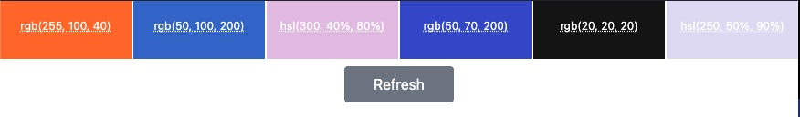

# Kanopi - Color Swatch  [](https://github.com/yuhonas/kanopi/actions/workflows/frontend-site.yml) [](https://github.com/yuhonas/kanopi/actions/workflows/backend-api.yml)

A basic color swatch "renderer" built using [Vue.js](https://vuejs.org/) & [Nuxt](https://nuxt.com/), essentially the VueJS equivalent of [Next.JS](https://nextjs.org/)



## Project Organization

The project is divided into two components, this project and the backend [API](./api) which is the data provider for this component

## Design Rationale

First of all, i've been using Vue.js recently for personal projects so it was quicker for me to build something in that then React though I did do some brief research into some of the available components in the React ecosystem like
* [react-color-swatch](https://www.npmjs.com/package/@uiw/react-color-swatch)
* [react color](https://casesandberg.github.io/react-color/)

I also looked into Adobe's [leonardo](https://github.com/adobe/leonardo) but then time boxed it & made a call to optimize for discussion rather then the perfect implementation & tooling

## Getting Started

### Dependencies
* Node 20.x
* NPM 10.x

### Installation

You can checkout the repo using

```
git clone git@github.com:yuhonas/kanopi.git
```

Install dependencies using

```
npm install
```

See [package.json](./package.json) for other useful tasks

### Development

You can run a development server using

```
npm run dev
```

It defaults to serving a local JSON file as the backend data source see [nuxt.config.ts](./nuxt.config.ts#L16) you can override this by modifying the config or overiding it an `ENV` variable to the backend data source eg.

```
NUXT_PUBLIC_API_URL=http://www.example.com npm run dev
```

If you want something live to test against, the most recent deployed backend API URL is always available as build output in the [Backend API CD Jobs](https://github.com/yuhonas/kanopi/actions/workflows/backend-api.yml), it will be in the "Build Summary" in the job's detail


## Design Goals

* Simplicity
* Readability
* Optimize for discussion, i've left notes where i've thought a snap judgement/unintentional hiring bias could be made
* A bit of over-engineering for fun to explore what can/should/shouldn't be done

## Limitations

* There is no test cases, i've only added basic linting in to keep thing's consistent, obviously this could be expanded in all kinds of ways

## Deployment

This static site is currently deployed to github pages see [yuhonas.github.io/kanopi](https://yuhonas.github.io/kanopi/) via a [Github Action CD Job](./.github/workflows/frontend-site.yml)

## Extending

This has been designed with adding non conventional color spaces in mind eg. `BRGB` so there is an abstraction layer to deal with a color space "type" and some way to render it into a _web safe version_ eg. let's implement BRGB

> BRGB stores the red, green, and blue components as values between 0 and 10000 (inclusive).

Assuming from the [API](https://j8adom76wl.execute-api.ap-southeast-2.amazonaws.com/openapi.json) we're getting a record of

```json
[
  {
    "type": "brgb",
    "red": "3000",
    "green": "500",
    "blue": "9000"
  }
]
```

We'll need to add the appropriate converter logic on the [ frontend color parser ](./components/colorswatch.js) so we have a mapping of that "type" to a web safe renderable version eg.

```javascript
const brgbConverter = ({ red, green, blue }) => {
  const parsedColor = someFictionalBRGBParser.parse(red, green, blue)

  return {
    name: parsedColor.someName(); // a name to be displayed in the rendered swatch
    hex: parsedColor.hex(), // a web safe version of this color
  };
};
```

Then you'll need to add a way to instantiate that converter based on the type via the factory design pattern in [colors_swatch.js](./components/colorswatch.js)

```javascript
    case "rgb":
      return rgbConverter(colors);
```


## My closing thoughts 🤔
* The implementation is _OK_ I have quite a few gripes with it that stem from a few things
  *


## Design goals
* Django for an API at this stage seems over-engineered, model/template/form/admin/emails
* Something simple, popular, standards based
* High signal to noise to optimize for reviewability

* input [color element](https://developer.mozilla.org/en-US/docs/Web/HTML/Element/input/color)


## Assumptions
TBD

## Performance
* There is no IO/persistence layer
* Big O Time Complexity is O(1), Constant time, irespective of input it will remain constant time as the enumeration is fixed
* There is 255^3 colors in RGB (16,777,216), We have 5 colors in the swatch so potentially we have (255^3)^5 possible combinations
* If we have performance SLA's we could implement something like [pytest-benchmark](https://pypi.org/project/pytest-benchmark/) into the CI pipeline

## Suggestions
TBD

## Links
- [ ] Implement [Env Variables](https://vitejs.dev/guide/env-and-mode)
- [ ] Where's it going to be embedded? styling etc
- [ ] [Error Handling](https://stackoverflow.com/questions/48656993/best-practice-in-error-handling-in-vuejs-with-vuex-and-axios)
## Links
- [Tree swing story](https://www.zentao.pm/blog/tree-swing-project-management-tire-analogy-426.html)
- [Microservice Template](https://microservices.io/patterns/service-template.html)
- Best practice [folder structure](https://masterlwa.medium.com/structuring-your-mern-stack-project-best-practices-and-organization-5776861e2c92)
- https://github.com/drwpow/openapi-typescript
- https://www.youtube.com/watch?v=hAzg2iBe6cg

- [Most Popular Color Formats](https://developer.chrome.com/docs/css-ui/high-definition-css-color-guide)
- [Django Rest Framework](https://www.django-rest-framework.org/)
- https://www.github.com/adobe/leonardo
- https://vue-styleguidist.github.io/docs/Documenting.html#code-comments

* https://github.com/adobe/leonardo?tab=readme-ov-file
* https://github.com/d3/d3-color?tab=readme-ov-file
* https://www.npmjs.com/package/@uiw/react-color-swatch
